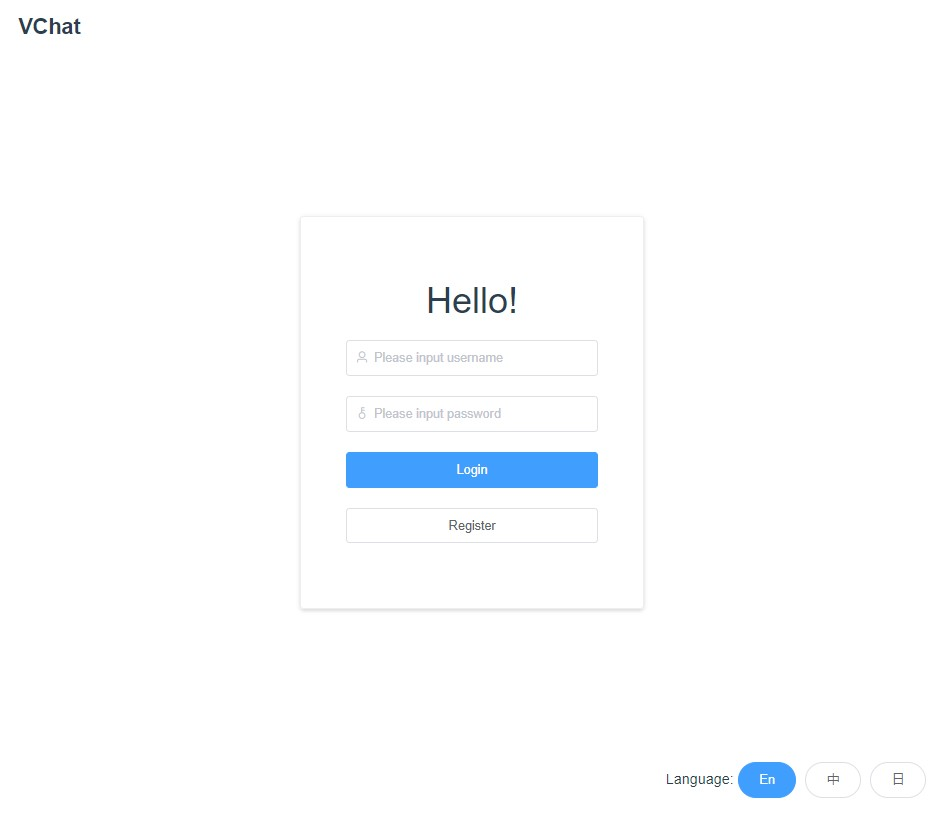
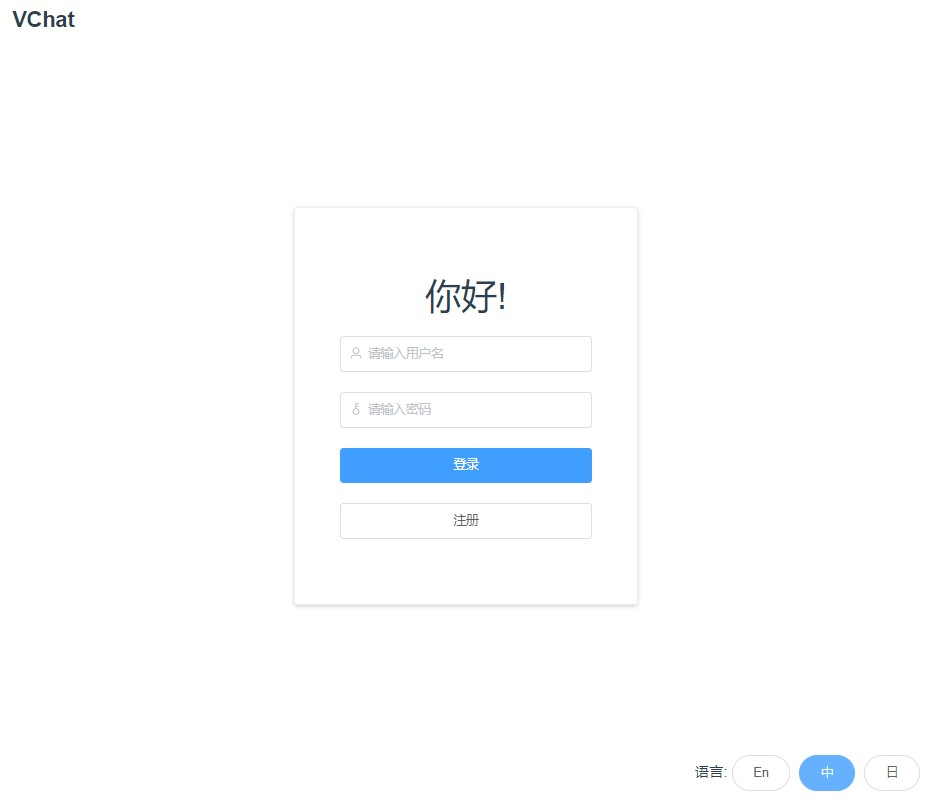
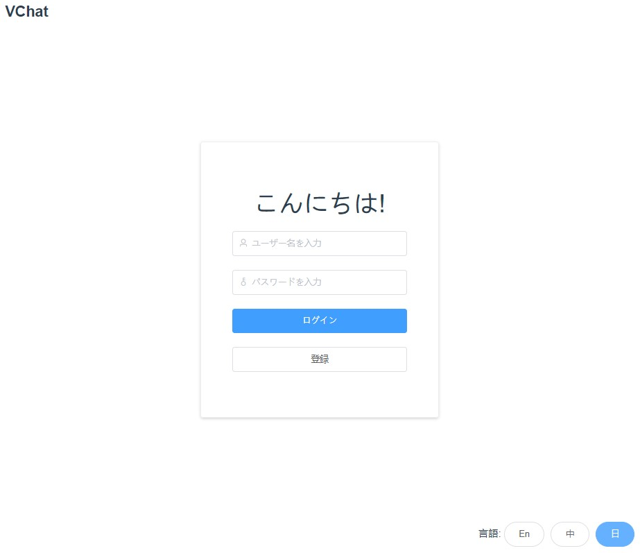
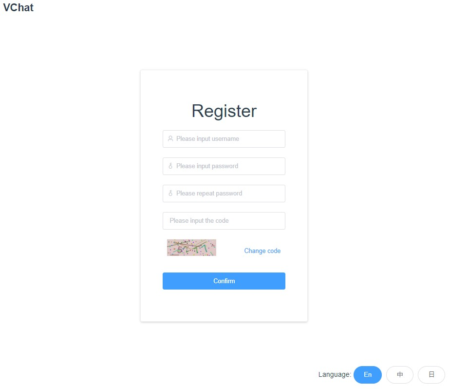
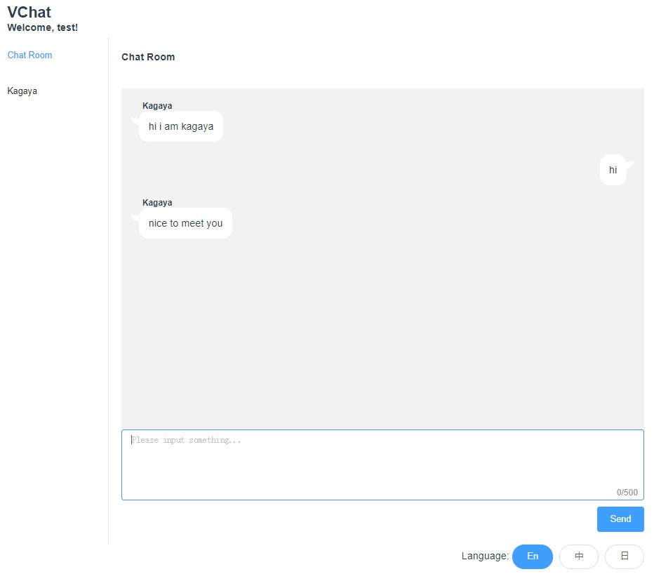

# VChat

🍥一个包含了前端 + 后端 + 数据库的聊天室web应用⚓

## Features

* 登陆验证
* 注册新用户
* 聊天室群聊
* 私聊
* 用户上线下线提醒
* 国际化i18n支持：English/中文/日本語
* 前后端分离开发

## Technology stack

#### 前端

* Vue全家桶：Vue + Vuex + Vue-router + Vue-i18n
* axios
* socket.io
* element

#### 后端

* node
* express
* socket.io

#### 数据库

* MongoDB

## Screen Shot

#### Login







#### Register



#### Home page



## Project setup

```shell
npm install
```

### Compiles and hot-reloads for development
```shell
npm run serve
```

### Compiles and minifies for production
```shell
npm run build
```

### Run server

```shell
cd ./server && node server
```

